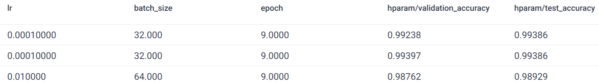
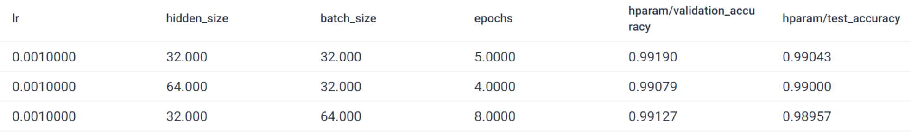

# CNN_Resnet_MNIST_Optuna

This project implements various deep learning models to classify the MNIST dataset, utilizing both Convolutional Neural Networks (CNN) and [ResNet architectures](https://pytorch.org/vision/main/models/resnet.html). The main functionality includes hyperparameter optimization using Optuna and training visualization with TensorBoard.

## Table of Contents
- [Project Overview](#project-overview)
- [Features](#features)
- [Installation](#installation)
- [Usage](#usage)
- [TensorBoard Visualization](#tensorboard-visualization)
- [Results](#results)

## Project Overview

This project aims to demonstrate the use of deep learning models for handwritten digit recognition on the MNIST dataset. It offers the ability to run different models, perform hyperparameter tuning, and visualize training metrics.

## Features

- Implements CNN and ResNet architectures for MNIST classification.
- Supports hyperparameter optimization using Optuna with pruning strategies.
- Allows for running studies to analyze model performance.
- Visualizes training metrics using TensorBoard.

## Installation

```bash
git clone https://github.com/ekomlenovic/CNN_Resnet_MNIST_Optuna.git
cd CNN_Resnet_MNIST_Optuna
conda create -f environment.yml
conda activate ml
```

## Usage

To run the project, you can use the command line to specify the model and parameters. The default model is CNN. Here are some command-line options:

```bash
python main.py [-cnn] [-resnet] [-study-cnn] [-study-resnet]
```
## TensorBoard Visualization
Training metrics such as loss and accuracy are logged to TensorBoard. To visualize the training process, run:

```bash
tensorboard --logdir=runs
```

Then navigate to `http://localhost:6006` in your web browser to see the training progress.


## Results

The performance results of the ResNet and CNN models on the MNIST dataset are shown below:  
- ResNet Results
  
- CNN Results  


Both ResNet and our CNN models yield comparable results in terms of accuracy. However, it is noteworthy that fine-tuning the ResNet model requires significantly less training time compared to the CNN model. This indicates that while both architectures are effective, the ResNet offers a more efficient approach for this particular dataset.


